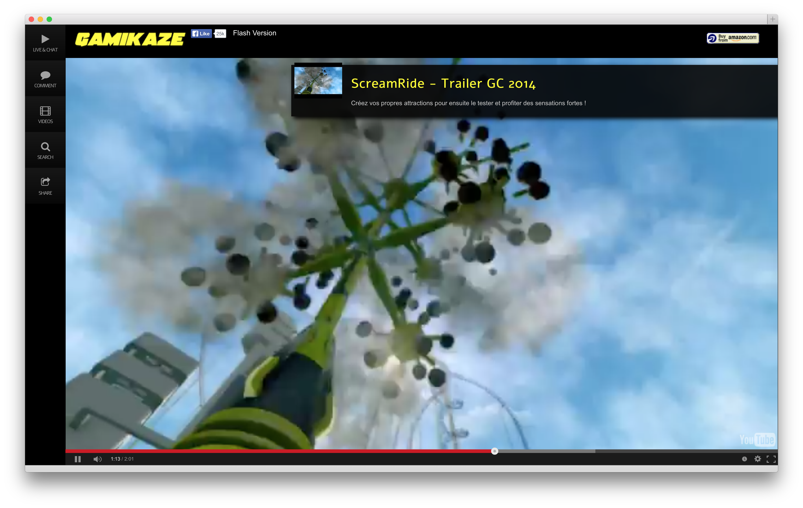
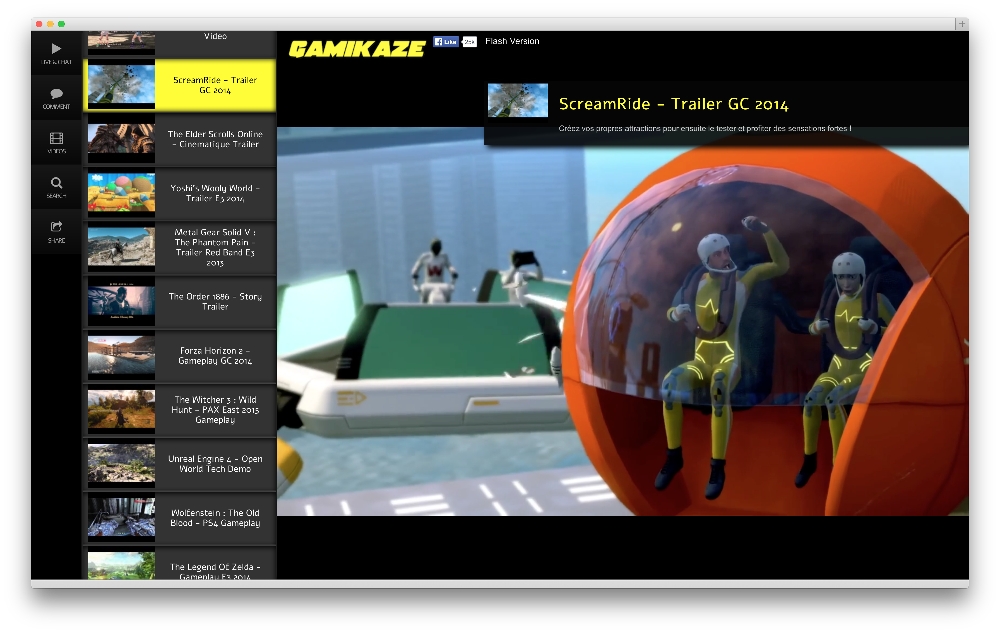
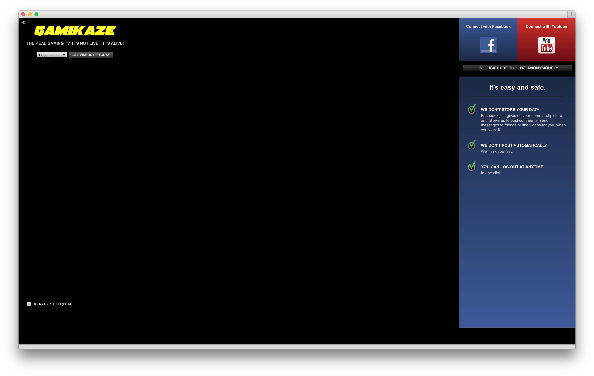

# GamikazeTV
Source of http://gamikaze.tv, an online TV experience
------------------------------------

**Release date:** 07/2012

**Development time:** 2 months

**Requirements**

- PHP 5.5 with Zend Framework (see Lab repo) and MySQL
- AngularJS
- Flex 4.6 with RTMP

**Functionalities**

The concept is the following: this is a "TV" website. And by TV I mean everyone is watching the same program, at the same time. Behind the scenes, this is using the YoutubeAPI. The Facebook API and the Youtube API login were added later.

- Flash version : this was the first version made, with the following features:
	- Comment / chat in realtime via P2P (RTMP)
	- Captions and translation of captions and UI (_this is not currently working as Google removed their translation API_)
	
- AngularJS version:
	- Comment / chat in realtime using Ratchet (PHP)
	- Search
	- Share
	- Buy the games shown on Amazon (this was the only business side of that small experiment)

**User's manual : **

1. Go to http://gamikaze.tv
2. Enjoy the show

**Developer's manual**

1. For the Flash version: install Flash Builder 4.6 Premium or Intellij IDEA Premium
2. Make sure the Lab repo is checked out and this repo folder is included inside the Lab repo (the Lab's .gitignore contains GamikazeTV). 

**Screenshots**

(Flash version not currently working due to missing data)

